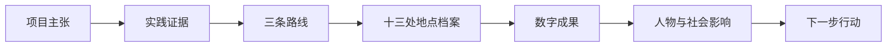

# 《行走的坐标》前端完整改版方案

> 文档版本：V1.3
> 编制日期：2026-07-27  
> 文档类型：生产级前端设计简报与实施规格  
> 适用范围：首页、寻访路线、数字成果、精神传承四个公开页面  
> 视觉方向：C“纪实叙事混合型”为骨架，融合 A“电影式首屏”和 B“坐标档案系统”

## 1. 项目定义

### 1.1 产品定位

《行走的坐标》是北京科技大学社会实践成果的数字展示网站。网站通过路线、地点、现场记录与成果档案，将线下革命史迹寻访组织成可浏览、可理解、可核验、可传播的线上叙事。

### 1.2 目标用户

#### 1.2.1 成果评审者

成果评审者需要在 60 秒内确认项目主题、实践范围、完成方式与核心成果，并能进一步检查路线、地点和材料依据。

#### 1.2.2 北京科技大学师生

校内用户需要了解实践过程、教学价值和团队成果，并能快速转发具体路线或成果页面。

#### 1.2.3 红色文化教育参与者

教育工作者与社区参与者需要按地点理解历史背景、青年实践方式和传播成果。

#### 1.2.4 普通公众

公众用户需要在较低的知识门槛下，通过路线、图像和人物叙事理解项目，并获得清楚的浏览路径。

### 1.3 核心目标

#### 1.3.1 可信

每项重要叙述都由地点、日期、坐标、记录方式、资料来源或成果文件支撑。

#### 1.3.2 可达

桌面端与移动端均能稳定访问首页、路线、成果和传承页面；键盘、屏幕阅读器和减少动态效果模式均可完成主要浏览流程。

#### 1.3.3 独特

“坐标”从装饰概念升级为全站的信息系统，由经纬度、路线编号、采集时间、记录人、档案编号和内容状态共同构成品牌识别。

#### 1.3.4 可替换

当前无法获得真实素材时，页面使用尺寸稳定、身份明确的示意素材。真实素材到位后，仅替换清单中的文件和元数据，页面结构与组件无需重做。

### 1.4 成功指标

| 指标 | 目标 |
|---|---:|
| 首次访问者理解项目主题 | 5 秒内 |
| 评审者找到路线、地点与成果证据 | 60 秒内 |
| 移动端一级栏目可达率 | 100% |
| 键盘完成核心浏览流程 | 100% |
| WCAG 2.2 AA 自动检测重大错误 | 0 |
| Lighthouse Accessibility | ≥ 95 |
| Lighthouse Performance（移动端） | ≥ 85 |
| LCP | ≤ 2.5 秒 |
| CLS | ≤ 0.1 |
| INP | ≤ 200 毫秒 |

## 2. 设计方向

### 2.1 视觉策略

#### 2.1.1 色彩策略

Hero 与地图采用 Drenched 策略，让深红与黑色成为场景本身；正文与档案区采用 Committed 策略，以黑、白、深红为主体，并使用少量琥珀色承担坐标和档案字段强调。

#### 2.1.2 场景句

一位成果评审者在夜间展厅般的电脑屏幕前浏览一份青年实践档案：环境沉静、内容可信、路线发光，真实证据随着滚动逐步展开。

#### 2.1.3 参考锚点

| 参考 | 采用的能力 |
|---|---|
| The Verge | 戏剧化高对比构图、非对称首屏、强烈标题尺度 |
| CNET | 密集但清楚的内容导航、信息分区与快速浏览能力 |
| 故宫数字文物库 | 档案字段、对象详情、来源与状态的可信表达 |

### 2.2 方向探针结论

#### 2.2.1 全站骨架

采用方向 C 的“纪实叙事混合型”：内容沿实践叙事连续展开，三条路线形成章节，移动导航与素材状态成为系统组成部分。

#### 2.2.2 首页首屏

采用方向 A 的电影式首屏：一张决定性影像与大标题形成第一峰值，路线光轨和证据条负责将情绪落到事实。

#### 2.2.3 路线与地点详情

采用方向 B 的坐标档案结构：路线索引、地图、地点档案三者同屏协作，当前路线、地点和材料状态始终可见。

### 2.3 视觉探针

#### 2.3.1 方向 A：电影式首屏


#### 2.3.2 方向 B：坐标档案系统


#### 2.3.3 方向 C：纪实叙事混合型


### 2.4 品牌人格

#### 2.4.1 庄重

历史内容以准确名称、档案字段和真实语境呈现，视觉节奏保持克制。

#### 2.4.2 可信

所有图片、影片、报告与 VR 均显示内容状态、来源或替换身份；示意素材具有明确标识。

#### 2.4.3 青年化

行动、采集和传播承担叙事重点。青年化来自真实工作方式、镜头语言和交互节奏，而非娱乐化符号。

## 3. 信息架构

### 3.1 一级导航

| 栏目 | 路径 | 用户问题 |
|---|---|---|
| 首页 | `/` | 这是一个什么项目，为什么可信？ |
| 寻访路线 | `/journey` | 团队去了哪里，在每个地点做了什么？ |
| 数字成果 | `/outcomes` | 项目最终形成了哪些可以查看的成果？ |
| 精神传承 | `/legacy` | 寻访之后产生了什么影响与下一步行动？ |

### 3.2 导航规则

#### 3.2.1 桌面端

顶部导航固定显示四个一级栏目，当前栏目使用文字色、下划线和 `aria-current="page"` 三种方式共同表达。

#### 3.2.2 移动端

顶部保留品牌标识与 44×44px 菜单按钮。菜单以全宽面板展开，包含四个一级栏目、当前栏目、关闭按钮和“查看三条路线”快捷入口。

#### 3.2.3 深层直达

路线与地点使用可分享 URL，例如：

```text
/journey?route=awakening&site=beida-honglou
```

页面加载时根据 URL 恢复当前路线和地点。

### 3.3 全站叙事顺序



## 4. 全局设计系统

### 4.1 色彩系统

| Token | 建议值 | 用途 |
|---|---|---|
| `--red` | `oklch(0.36 0.135 24)` | 主品牌红、当前路线、主按钮 |
| `--red-deep` | `oklch(0.245 0.082 22)` | Hero 深红、暗部层次 |
| `--red-bright` | `oklch(0.59 0.205 25)` | 节点、状态、交互强调 |
| `--ink` | `oklch(0.115 0 0)` | 主背景、正文深色 |
| `--paper` | `oklch(0.97 0.006 24)` | 正文浅色背景 |
| `--paper-pure` | `oklch(1 0 0)` | 高对比文字 |
| `--amber` | `oklch(0.72 0.12 70)` | 坐标、日期、档案字段 |
| `--muted-dark` | `oklch(0.72 0.01 24)` | 深色背景次要文字 |
| `--muted-light` | `oklch(0.42 0.015 24)` | 浅色背景次要文字 |

### 4.2 字体系统

#### 4.2.1 中文标题

标题使用可稳定加载的中文黑体系统栈，依靠 800–900 字重、尺寸和紧凑行距建立力量感。

```css
font-family: "Source Han Sans SC", "Noto Sans CJK SC",
  "Microsoft YaHei", "PingFang SC", sans-serif;
```

#### 4.2.2 中文正文

正文与标题使用同一字体家族的 400–600 字重，形成一致且高可读的中文体验。

#### 4.2.3 档案字段

经纬度、日期和档案编号使用数字辨识度较高的无衬线字体。英文与数字仅服务于真实字段，不承担装饰性水印。

#### 4.2.4 字级

| 角色 | 桌面端 | 移动端 |
|---|---:|---:|
| Hero H1 | `clamp(56px, 7vw, 96px)` | `clamp(42px, 13vw, 64px)` |
| 页面 H1 | `clamp(48px, 6vw, 80px)` | `clamp(36px, 11vw, 54px)` |
| Section H2 | `clamp(36px, 4.5vw, 68px)` | `clamp(30px, 8vw, 44px)` |
| H3 | 24–36px | 22–30px |
| 正文 | 16–18px | 16px |
| 档案字段 | 13–15px | 13–14px |

标题字距保持在 `-0.04em` 至 `-0.02em`，正文行长控制在 65–75 个字符。

### 4.3 间距与布局

#### 4.3.1 内容宽度

主内容最大宽度为 1440px；正文阅读区域最大宽度为 760px；档案详情区域最大宽度为 960px。

#### 4.3.2 栅格

桌面端使用 12 列栅格，平板端使用 8 列，移动端使用 4 列。地图页可采用 3/6/3 的路线索引、地图、档案三栏结构。

#### 4.3.3 垂直节奏

区块间距使用 80–160px 的流体范围；同一叙事组内使用 16–40px 紧密间距，让页面形成“展开—聚焦—展开”的节奏。

### 4.4 组件系统

#### 4.4.1 SiteHeader

包含品牌标识、一级导航、当前栏目和移动菜单。滚动后背景由透明过渡为近黑实色。

#### 4.4.2 EvidenceStrip

用于展示坐标、日期、记录人、设备、档案编号和内容状态。桌面端横向排列，移动端变为两列字段表。

#### 4.4.3 RouteIndex

展示三条路线、天数、地点数和当前状态。桌面端为纵向索引，移动端为可横向滚动的三个大触控入口。

#### 4.4.4 RouteMap

地图使用高德地图 JS API 2.0 加载真实在线底图，以经过核验的 GCJ-02 坐标放置地点节点，并按实践顺序连接同一路线的地点。路线连线表达寻访顺序，不表示实际步行、驾车或导航轨迹。每个视觉节点外层拥有至少 44×44px 的实际触控区，并支持键盘焦点与方向键导航。

高德地图加载失败时，地图区域保持空白，不显示伪造底图、错误提示或替代路线图；路线索引、地点列表、地点档案和其他页面服务继续可用。

#### 4.4.5 SiteDossier

地点档案包含地点名称、坐标、历史摘要、实践记录、资料来源、素材状态和相关地点。

#### 4.4.6 OutcomeRecord

成果以档案行或章节形式呈现，包含预览、状态、说明、发布日期和真实访问动作。

#### 4.4.7 MediaPlaceholder

示意素材保持与目标素材相同的宽高比和裁切位置，并显示素材 ID、用途和“示意素材”状态。

#### 4.4.8 StatusBadge

内容状态包括：

| 状态 | 用户文案 | 含义 |
|---|---|---|
| `placeholder` | 示意素材 | 当前为临时视觉材料 |
| `planned` | 内容筹备中 | 真实内容尚未完成 |
| `partial` | 部分开放 | 已提供部分材料 |
| `ready` | 已开放 | 内容达到公开标准 |

## 5. 首页方案

### 5.1 页面目标

首页在一个首屏内回答三个问题：项目是什么、团队如何实践、用户下一步可以查看什么。

### 5.2 首屏结构

#### 5.2.1 顶部导航

导航覆盖在深色场景上，保持清楚的当前栏目与移动菜单入口。

#### 5.2.2 主标题

主标题固定为：

> 行走的坐标  
> 革命史迹数字化寻访

辅助文案控制为两行，明确“北京、青年实践、数字记录”三个信息点。

#### 5.2.3 决定性影像

首屏使用一张横向团队行动影像。构图呈现“青年进入史迹现场并开始记录”的动作，而非站立合影。

#### 5.2.4 路线光轨

一条红色路线从标题区穿过影像，连接三个代表性节点。路线具有轻微首屏加载动画，并为减少动态效果用户提供静态版本。

#### 5.2.5 证据条

首屏底部固定展示：

- 实践周期：14 天
- 路线数量：3
- 史迹坐标：13
- 记录方式：影像、访谈、全景、资料整理
- 内容状态：示意素材阶段

### 5.3 首页主体

#### 5.3.1 项目方法

使用一条横向实践链展示“寻访—采集—解码—传播”，每一步对应具体动作和一项证据。

#### 5.3.2 三条路线

三条路线作为连续章节展开。每章包含路线名称、时间范围、代表坐标、代表影像和进入路线按钮。

#### 5.3.3 核心成果

成果区展示线上展厅、数字档案、主题微电影和调研报告的真实内容状态。可访问成果提供明确动作，筹备中成果显示预计交付条件。

#### 5.3.4 结尾行动

首页结尾提供“浏览完整路线”和“查看成果状态”两个动作。

## 6. 寻访路线页方案

### 6.1 页面目标

路线页让用户在不丢失上下文的情况下完成“选择路线—选择地点—阅读档案—继续下一个地点”的循环。

### 6.2 桌面端结构

#### 6.2.1 左栏：路线索引

三条路线始终可见，显示天数、地点数和当前路线。

#### 6.2.2 中栏：地图

地图使用高德地图 JS API 2.0 在线底图。地点坐标全部经过候选生成和人工核验，路线按地点顺序连接。当前路线保持高亮，其他路线退为背景信息。地图不提供导航或路径规划，不将连接线描述为实际行进轨迹。

#### 6.2.3 右栏：地点档案

当前地点档案显示：

- 地点正式名称
- 经纬度
- 路线与顺序
- 历史摘要
- 实践动作
- 当前素材
- 资料来源
- 内容状态
- 上一地点与下一地点

### 6.3 移动端结构

#### 6.3.1 顺序

移动端按“路线选择—地点列表—当前地点档案—折叠地图”的顺序组织，地点列表承担主导航，地图承担空间理解。

#### 6.3.2 反馈

点击地点后页面滚动到档案标题，并通过短暂高亮与屏幕阅读器状态消息确认切换结果。

#### 6.3.3 分享

每个地点提供复制链接动作，URL 保存当前路线和地点。

### 6.4 三条路线

| 路线 | 地点 |
|---|---|
| 觉醒之路 | 北大红楼、《新青年》编辑部旧址、李大钊故居、京报馆旧址、鲁迅博物馆 |
| 烽火之路 | 中国人民抗日战争纪念雕塑园、卢沟桥、宛平城、中国人民抗日战争纪念馆、百望山黑山扈战斗纪念园 |
| 进京之路 | 香山革命纪念地、中国共产党历史展览馆、清华园车站旧址 |

## 7. 数字成果页方案

### 7.1 页面目标

成果页清楚区分“已经可查看的成果”“已经形成但尚未公开的成果”和“仍在筹备的成果”。

### 7.2 首屏

首屏以真实成果对象或明确示意图为主体，并展示成果完成度总览。

### 7.3 成果结构

#### 7.3.1 数字线上展厅

展示路线地图、地点档案和现场记录的内容范围，并提供进入展厅动作。

#### 7.3.2 数字档案

展示档案字段、素材数量、分类方式和示例条目。

#### 7.3.3 主题微电影

真实影片到位前展示影片规格、叙事结构、预计时长和拍摄需求。真实影片到位后显示封面、字幕状态、时长和播放入口。

#### 7.3.4 实践调研报告

报告到位前展示目录结构和待交付状态。报告到位后提供摘要、页数、发布日期和下载入口。

### 7.4 图库

图库按“进入现场—团队行动—对象细节—人物交流—成果形成”的顺序组织。灯箱支持键盘切换、焦点捕获、关闭后焦点恢复和图片说明。

## 8. 精神传承页方案

### 8.1 页面目标

精神传承页回答“寻访之后发生了什么”，用人物、行动和结果完成全站结尾。

### 8.2 内容结构

#### 8.2.1 人物原话

使用一名参与学生、讲解员或社区参与者的真实原话作为首屏核心，多个对话反复滚动。

#### 8.2.2 行动结果

展示社区宣讲、课程使用、资料入库、展映或后续研究等可核验结果。

#### 8.2.3 影响时间线

时间线从实地寻访延伸到整理、传播和下一次行动。

#### 8.2.4 最终行动

页面以“浏览完整路线”“查看成果”“联系团队”三个动作收束。

## 9. 交互模型

### 9.1 页面进入

首屏内容默认可见，动画用于增强层次。首次加载采用标题揭示、路线绘制和证据条出现三段节奏，总时长控制在 1.2 秒内。

### 9.2 路线切换

路线切换同步更新地图、地点列表、档案面板和 URL。反馈在 200 毫秒内开始，内容切换采用短交叉淡化。

### 9.3 地点切换

地点选择后，地图节点、地点标题和档案编号同步更新。移动端自动将档案标题带入可视区域。

### 9.4 灯箱

灯箱使用原生 `<dialog>` 或 portal 实现，支持：

- Esc 关闭
- 左右方向键切换
- 焦点捕获
- 图片计数
- 图片说明
- 关闭后焦点返回

### 9.5 减少动态效果

`prefers-reduced-motion: reduce` 下，路线绘制、缩放和位移动画切换为即时状态或短交叉淡化。

## 10. 内容与状态模型

### 10.1 共享状态与字段级来源

```ts
type ReviewStatus = "draft" | "needs-review" | "reviewed";

type PublicationStatus =
  | "placeholder"
  | "planned"
  | "partial"
  | "ready";

interface SourcedField<T> {
  value: T;
  sourceIds: string[];
}

interface SourcedContentBlock {
  id: string;
  text: string;
  sourceIds: string[];
}
```

`reviewStatus` 表示内部事实是否经过人工审核，`publicationStatus` 表示公开页面应如何呈现。两者相互独立。公开仓库中的审核身份只保存 `project-owner`、`coordinate-reviewer` 等角色标识，不保存授权书、身份证明或内部联系方式。

### 10.2 坐标数据

```ts
type CoordinateRecord =
  | {
      status: "missing";
    }
  | {
      status: "candidate";
      lat: number;
      lng: number;
      crs: "GCJ-02";
      target: "main-entrance" | "site-center";
      sourceId: string;
      queriedAt: string;
    }
  | {
      status: "verified";
      lat: number;
      lng: number;
      crs: "GCJ-02";
      target: "main-entrance" | "site-center";
      precision: "verified-poi" | "manual-pin";
      sourceId: string;
      verifiedAt: string;
      verifiedBy: "coordinate-reviewer" | "project-owner";
    };
```

### 10.3 路线数据

```ts
interface RouteRecord {
  id: "awakening" | "war" | "capital";
  title: SourcedField<string>;
  dayRange: SourcedField<string>;
  summary: SourcedContentBlock[];
  coordinateRegion: string;
  siteIds: string[];
  heroAssetId: string;
  reviewStatus: ReviewStatus;
  publicationStatus: PublicationStatus;
}
```

### 10.4 地点数据

```ts
interface SiteRecord {
  id: string;
  routeId: RouteRecord["id"];
  order: number;
  name: SourcedField<string>;
  officialAddress: SourcedField<string> | null;
  coordinate: CoordinateRecord;
  historySummary: SourcedContentBlock[];
  practiceSummary: SourcedContentBlock[];
  assetIds: string[];
  reviewStatus: ReviewStatus;
  publicationStatus: PublicationStatus;
}
```

### 10.5 素材清单

```ts
interface AssetBase {
  id: string;
  role: "hero" | "route" | "site-cover" | "action" | "detail" |
    "portrait" | "outcome" | "video" | "vr" | "document";
  shotRequirement: string;
  reviewStatus: ReviewStatus;
  publicationStatus: PublicationStatus;
  rightsStatus: "unknown" | "restricted" | "cleared";
  consentStatus: "not-required" | "pending" | "obtained";
  usageScopes: Array<"website" | "social" | "press" | "archive">;
  rightsRecordRef: string | null;
}

type AssetRecord =
  | (AssetBase & {
      assetStatus: "placeholder" | "planned";
      placeholderSrc: string;
    })
  | (AssetBase & {
      assetStatus: "ready";
      rightsStatus: "cleared";
      consentStatus: "not-required" | "obtained";
      finalSrc: string;
      alt: string;
      credit: string;
      captureDate: string;
    });
```

### 10.6 成果数据

```ts
interface OutcomeBase {
  id: string;
  order: number;
  title: SourcedField<string>;
  description: SourcedContentBlock[];
  ownerRole: string;
  reviewStatus: ReviewStatus;
  publicationStatus: PublicationStatus;
  assetId: string | null;
  updatedAt: string;
}

type OutcomeRecord =
  | (OutcomeBase & {
      completionStatus: "planned" | "in-progress";
      deliveryCondition: string;
      access: null;
      publishedAt: null;
    })
  | (OutcomeBase & {
      completionStatus: "complete";
      deliveryCondition: null;
      access: {
        kind: "link" | "download" | "play";
        href: string;
        label: string;
      };
      publishedAt: string;
    });
```

### 10.7 替换原则

真实素材到位后，素材经过文件、授权、同意、替代文本、署名、拍摄日期和用途审核，再将 `assetStatus` 切换为 `ready`。布局读取固定素材 ID，因此替换过程不改变页面组件结构。授权书原件和服务器密钥不进入公开仓库。

## 11. 临时素材方案

### 11.1 临时素材身份

临时素材使用单色或低饱和度纪实构图，并在页面可见区域显示“示意素材”。临时影像承担构图与尺寸验证，不承担历史证据。

### 11.2 临时素材版式

每张临时素材包含：

- 素材 ID
- 目标场景名称
- 目标宽高比
- 一句拍摄要求
- 内容状态

### 11.3 上线状态

#### 11.3.1 素材筹备阶段

页面公开展示示意素材身份和内容状态，保持叙事诚实。

#### 11.3.2 素材替换阶段

真实素材按本文件第 12 章命名和替换，逐条将状态切换为 `ready`。

#### 11.3.3 正式发布阶段

所有首屏关键素材、三条路线封面和公开成果入口达到 `ready` 状态；其余部分可保留明确的 `planned` 或 `partial` 状态。

## 12. 素材替换单

### 12.1 摄影统一技术要求

| 项目 | 要求 |
|---|---|
| 原始格式 | RAW + 高质量 JPEG |
| 最低分辨率 | 长边 ≥ 6000px |
| 色彩 | sRGB 交付，同时保留原始 RAW |
| 横向主画幅 | 3:2 与 16:9 各保留安全裁切 |
| 竖向主画幅 | 4:5，主体位于中部 60% 安全区 |
| 构图 | 同一场景提供远景、中景、细节各一组 |
| 人物授权 | 可识别人物完成肖像与传播授权 |
| 现场记录 | 同步记录地点、日期、摄影者、设备和一句场景说明 |
| 后期 | 保留环境真实色彩，控制高光，深色区域保留细节 |
| 水印 | 原始交付文件保持无水印 |

### 12.2 文件命名

```text
WC_<素材ID>_<地点英文slug>_<YYYYMMDD>_<摄影者缩写>_V01.jpg
```

示例：

```text
WC_SA01_beida-honglou_20260712_ZS_V01.jpg
```

### 12.3 首页素材

| ID | 页面位置 | 叙事任务 | 拍摄要求 | 画幅与分辨率 | 目标文件 |
|---|---|---|---|---|---|
| H01 | Hero 主影像 | 表现青年团队进入史迹现场并开始工作 | 3–6 名队员背向或侧向进入建筑，至少一人携带相机或记录设备；建筑名称可辨识；预留左侧标题空间 | 16:9，≥ 3840×2160 | `public/images/final/home/hero-main.webp` |
| H02 | Hero 次影像 | 表现数字采集动作 | 手持相机、录音设备、扫描或笔记的中近景；手部动作清楚 | 4:5，≥ 2400×3000 | `public/images/final/home/hero-action.webp` |
| H03 | 项目方法 | 表现现场交流 | 队员与讲解员或社区参与者交谈，人物关系自然 | 3:2，≥ 3000×2000 | `public/images/final/home/method-interview.webp` |
| H04 | 项目方法 | 表现资料整理 | 桌面俯拍，包含笔记、地图、相机与档案编号卡 | 3:2，≥ 3000×2000 | `public/images/final/home/method-archive.webp` |
| H05 | 首页结尾 | 团队共同完成阶段性成果 | 工作状态合影，环境包含电脑、打印材料或展板 | 16:9，≥ 3840×2160 | `public/images/final/home/team-outcome.webp` |

### 12.4 路线封面素材

| ID | 路线 | 拍摄要求 | 画幅与分辨率 | 目标文件 |
|---|---|---|---|---|
| RA01 | 觉醒之路 | 北大红楼或相关建筑与青年进入现场同框；体现思想启蒙的起点 | 16:9，≥ 3840×2160 | `public/images/final/routes/awakening.webp` |
| RB01 | 烽火之路 | 中国人民抗日战争纪念雕塑园、卢沟桥或宛平城的广角环境，人物比例较小，突出历史尺度 | 16:9，≥ 3840×2160 | `public/images/final/routes/war.webp` |
| RC01 | 进京之路 | 香山革命纪念地的路径与行进人物，或中国共产党历史展览馆前的团队行进画面，体现向前方向感 | 16:9，≥ 3840×2160 | `public/images/final/routes/capital.webp` |

### 12.5 十三处地点标准拍摄包

每个地点完成四张基础素材：

| 后缀 | 角色 | 拍摄内容 | 画幅 |
|---|---|---|---|
| `COVER` | 地点封面 | 建筑或遗址的明确外观，地点身份可辨识 | 16:9 |
| `ACTION` | 实践行动 | 队员正在听讲、记录、拍摄、访谈或采集 | 3:2 |
| `DETAIL` | 历史细节 | 铭牌、文物、建筑细节、档案或环境纹理 | 4:3 |
| `PORTRAIT` | 人物联系 | 队员、讲解员或受访者的环境肖像 | 4:5 |

#### 12.5.1 地点清单

| 前缀 | 地点 | 必拍识别要素 | 现场补充要求 |
|---|---|---|---|
| SA01 | 北大红楼 | 红楼立面、门牌或展陈标题 | 拍摄队员进入与现场记录动作 |
| SA02 | 《新青年》编辑部旧址 | 旧址外观、相关展板或刊物展示 | 拍摄刊物细节与阅读动作 |
| SA03 | 李大钊故居 | 院落、门牌、生活空间 | 拍摄安静观察与笔记动作 |
| SA04 | 京报馆旧址 | 建筑外观、报馆相关标识 | 拍摄报刊资料与讲解场景 |
| SA05 | 鲁迅博物馆 | 馆体、馆名、鲁迅生平与文学相关展陈 | 拍摄文学史料细节、队员参观或阅读动作 |
| SB01 | 中国人民抗日战争纪念雕塑园 | 雕塑群、园区入口、主题说明 | 以广角呈现雕塑群与团队观察、记录的尺度关系 |
| SB02 | 卢沟桥 | 桥体、石狮、河岸环境 | 远景体现桥体，细节记录石狮与路面 |
| SB03 | 宛平城 | 城门、城墙、地名标识 | 拍摄城门纵深、队员行进与现场讲解 |
| SB04 | 中国人民抗日战争纪念馆 | 馆体、馆名、核心展陈空间 | 拍摄队员面向大型展陈的尺度关系 |
| SB05 | 百望山黑山扈战斗纪念园 | 纪念设施、山地路径 | 拍摄行进、停留与环境记录 |
| SC01 | 香山革命纪念地 | 纪念地环境、路线或展陈 | 画面体现“进京”方向感 |
| SC02 | 中国共产党历史展览馆 | 馆体、馆名、主题展陈 | 拍摄团队进入场馆、观看大型展陈与记录动作 |
| SC03 | 清华园车站旧址 | 站房、站名或铁路相关元素 | 拍摄站点空间与行进关系 |

#### 12.5.2 地点文件路径

```text
public/images/final/sites/<site-slug>/cover.webp
public/images/final/sites/<site-slug>/action.webp
public/images/final/sites/<site-slug>/detail.webp
public/images/final/sites/<site-slug>/portrait.webp
```

### 12.6 数字成果素材

| ID | 成果 | 素材要求 | 规格 | 目标文件 |
|---|---|---|---|---|
| O01 | 数字展厅 | 展厅首页或路线档案的真实界面截图 | 16:10，≥ 2560×1600 | `public/images/final/outcomes/exhibition.webp` |
| O02 | 数字档案 | 一条完整档案记录及字段细节 | 16:10，≥ 2560×1600 | `public/images/final/outcomes/archive.webp` |
| O03 | 主题微电影 | 正式封面，包含片名与真实主画面 | 16:9，≥ 3840×2160 | `public/images/final/outcomes/film-cover.webp` |
| O04 | 调研报告 | 报告封面与一张内页展开图 | 3:2，≥ 3000×2000 | `public/images/final/outcomes/report.webp` |
| O05 | 成果展映 | 观众观看、交流或讨论的现场 | 3:2，≥ 3000×2000 | `public/images/final/outcomes/screening.webp` |

### 12.7 精神传承素材

| ID | 页面位置 | 拍摄要求 | 画幅 | 目标文件 |
|---|---|---|---|---|
| L01 | 首屏人物 | 参与学生、讲解员或社区参与者环境肖像；视线自然，背景与事件相关 | 4:5 | `public/images/final/legacy/portrait.webp` |
| L02 | 社区行动 | 青年正在讲解或与社区人员交流，画面包含受众反应 | 16:9 | `public/images/final/legacy/community.webp` |
| L03 | 结果证据 | 课程使用、资料入库、展板、展映或反馈记录 | 3:2 | `public/images/final/legacy/impact.webp` |
| L04 | 结尾团队 | 团队离开或继续行进的背影，形成开放式结尾 | 16:9 | `public/images/final/legacy/closing.webp` |

### 12.8 视频与 VR

| ID | 类型 | 采集要求 | 交付规格 |
|---|---|---|---|
| V01 | 主题微电影 | 建立镜头、行进、现场交流、细节、人物原话、成果形成六类镜头完整 | 4K 25fps 主文件；1080p H.264 网页版；独立 SRT 字幕 |
| V02 | 首页短循环 | 5–8 秒无声行动镜头，首尾可自然循环 | 1920×1080，H.264/WebM，各 ≤ 4MB |
| VR01–VR13 | 地点全景 | 每个地点选择一个空间中心点，曝光一致，记录拍摄方位 | 2:1 等距柱状图，≥ 8192×4096 |

### 12.9 社交分享素材

| ID | 用途 | 要求 | 规格 | 目标文件 |
|---|---|---|---|---|
| S01 | 全站 OG 图 | 主标题、路线光轨、代表地点影像 | 1200×630 | `public/images/final/social/og-default.webp` |
| S02 | 路线分享图 | 路线名称、代表影像、地点数量 | 1200×630 | `public/images/final/social/og-route-*.webp` |

### 12.10 摄影现场记录表

每次拍摄同步填写：

| 字段 | 示例 |
|---|---|
| 素材 ID | `SA01-ACTION` |
| 地点 | 北大红楼 |
| 拍摄日期与时间 | 2026-07-12 14:30 |
| 摄影者 | 张三 |
| 设备与镜头 | Sony FX3 / 24–70mm |
| 画面人物 | 队员 3 人、讲解员 1 人 |
| 行为 | 听讲并记录展陈信息 |
| 授权状态 | 已取得 |
| 现场说明 | 二层展厅，新文化运动专题 |
| 对应文件 | `WC_SA01-ACTION_beida-honglou_20260712_ZS_V01.jpg` |

## 13. 响应式与无障碍

### 13.1 响应式断点

| 范围 | 结构 |
|---|---|
| ≥ 1200px | 12 列，路线页三栏 |
| 768–1199px | 8 列，地图与档案上下组合 |
| < 768px | 4 列，单列叙事与移动菜单 |

### 13.2 WCAG 2.2 AA 要求

#### 13.2.1 对比度

正文文字达到 4.5:1，大号文字和图形达到 3:1。深色背景次要文字使用通过实测的实体色值。

#### 13.2.2 键盘操作

所有链接、按钮、路线、地图节点、标签页和灯箱均可通过键盘操作，并具有清楚的 `:focus-visible`。

#### 13.2.3 语义

页面具有唯一 H1、顺序正确的标题层级、地标区域、`aria-current`、真实按钮语义和可访问的状态消息。

#### 13.2.4 图片替代文本

替代文本描述人物行为、地点和事件语境。装饰性图形使用空 alt 或 `aria-hidden`。

#### 13.2.5 动态效果

动画具有减少动态效果替代方案，内容默认可见，交互反馈不依赖动画完成。

## 14. 性能与工程约束

### 14.1 静态部署

前端继续使用 Next.js 静态导出与 GitHub Pages，保持 `/walking-coordinates` base path。高德地图 JS API 2.0 通过独立 Nginx 服务的 `/_AMapService` 安全代理转发请求，`securityJsCode` 只保存在服务器配置中。

仓库提交不包含真实 Key、安全密钥、服务器地址或授权材料。项目根目录使用已加入 `.gitignore` 的 `Deploy.local.md` 保存实际部署步骤；仓库另提供不含秘密的部署示例。

### 14.2 图片策略

每张图片提供 AVIF/WebP 与合理尺寸，使用 `srcset`、明确宽高和懒加载。首屏主图预加载，其余媒体按视口加载。

### 14.3 JavaScript

首页尽量保持服务端静态结构；客户端状态集中在移动菜单、路线选择、地点档案和灯箱。

### 14.4 数据集中化

路线、地点、成果和素材状态从集中数据文件读取，页面组件不重复硬编码相同文本。

### 14.5 SEO

每个页面具有独立标题、描述、Open Graph 图和规范链接。路线与地点直达 URL 可被分享并恢复状态。

### 14.6 地图依赖隔离

高德地图脚本、代理或网络请求失败时，地图容器保持空白。失败不得阻塞路线索引、地点列表、地点档案、导航、成果页或传承页，也不得触发全页错误边界。

## 15. 实施阶段

### 15.1 阶段零：数据、测试与 CI 基线

#### 15.1.1 目标

建立集中数据模型、字段级来源、审核与发布状态、素材授权、成果数据、坐标候选流程、测试工具和持续集成。

#### 15.1.2 交付

- RouteRecord、SiteRecord、CoordinateRecord、AssetRecord、OutcomeRecord 与 SourceRecord
- 数据校验器和缺失项报告
- Vitest、Playwright、axe-core 与视觉截图基线
- 静态站点预览命令
- GitHub Actions
- `.env.local.example` 与不含秘密的部署示例

### 15.2 阶段一：基础系统

#### 15.2.1 目标

建立设计 Token、字体、栅格、导航、移动菜单、焦点系统、状态徽章和素材清单数据结构。

#### 15.2.2 交付

- 全局 Token
- SiteHeader 与移动菜单
- EvidenceStrip
- MediaPlaceholder
- WCAG 基础规则

### 15.3 阶段二：首页

#### 15.3.1 目标

完成电影式 Hero、证据条、实践链、三路线章节、成果状态和结尾行动。

### 15.4 阶段三：路线与地点档案

#### 15.4.1 目标

完成路线索引、高德在线地图、核验坐标节点、寻访顺序连线、地点档案、移动地点列表、URL 状态恢复与分享。

### 15.5 阶段四：成果与传承

#### 15.5.1 目标

完成成果状态、图库灯箱、人物原话、行动结果、影响时间线和最终行动。

### 15.6 阶段五：素材替换与旧实现清理

#### 15.6.1 目标

将所有临时素材绑定到固定素材 ID，验证文件替换、状态切换、alt、署名、授权与日期更新流程；删除 `PracticeSite.tsx`、旧地图、重复页面数组、无引用样式和 `!important` 补丁覆盖，并收敛或移除 `custom.css`。

### 15.7 阶段六：验证与发布

#### 15.7.1 自动化验证

- TypeScript 类型检查
- ESLint
- Next.js 静态构建
- Playwright 四页面与主要交互测试
- axe-core WCAG 检查
- 320px、375px、768px、1024px、1440px 视觉回归
- Lighthouse 性能、无障碍、SEO 检查
- 所有内部链接与素材路径检查

#### 15.7.2 用户真实使用测试

邀请至少三类参与者完成测试：

1. 成果评审者：60 秒内找到三条路线、一个地点档案和成果状态。
2. 移动端普通用户：单手完成栏目切换、地点选择、图片查看与返回。
3. 键盘用户：不使用鼠标完成导航、路线切换、地点切换和灯箱关闭。

通过标准：

- 三类用户均完成核心任务；
- 没有迷失、无法返回或误认为示意素材是真实材料的情况；
- 用户能准确复述项目主题、路线数量和当前成果状态。

失败反馈需包含设备、浏览器、页面、操作步骤、预期结果、实际结果和截图或录屏。

#### 15.7.3 完成状态

“工程就绪”表示集中数据、四页面、响应式、高德地图、占位素材和自动化测试已经完成，可以合并带有明确“示意素材”标识的版本，但仍需继续完成真实内容和用户验收。

“内容发布就绪”表示真实地点记录、正式素材与授权、成果链接、人物原话、坐标人工核验和三类用户真实使用测试均已通过。只有该状态可以声明整体测试通过。

## 16. 验收标准

### 16.1 信息架构

- 四个一级页面在桌面端与移动端均可直接到达。
- 当前栏目始终可识别。
- 每个地点拥有可分享并可恢复状态的 URL。
- 高德地图失败时地图区域保持空白，其他页面与路线档案服务继续可用。

### 16.2 内容可信度

- 所有临时素材显示明确身份。
- 所有成果显示真实状态。
- 地点档案包含坐标、摘要、实践动作和资料来源字段。
- 公开动作与实际可访问内容一致。

### 16.3 视觉

- 红黑戏剧化风格贯穿全站。
- “坐标”通过路线、字段和档案编号形成稳定识别。
- 首页、路线、成果和传承页面具有各自明确的主视觉职责。
- 页面主要视觉由内容、路线和档案承担。

### 16.4 移动端

- 320px 宽度下无横向溢出。
- 一级导航完整可用。
- 所有触控目标至少 44×44px。
- 地点选择后用户能立即感知内容变化。

### 16.5 无障碍

- 达到 WCAG 2.2 AA。
- 键盘焦点可见且顺序合理。
- 灯箱、标签页和移动菜单具有完整焦点管理。
- 减少动态效果模式保持等价内容。

### 16.6 性能

- 达到第 1.4 节性能指标。
- 首屏素材尺寸与加载优先级正确。
- 所有图片保留宽高，页面无显著布局跳动。

## 17. 推荐实施命令顺序

### 17.1 设计系统记录

`$impeccable document`

用于将本方案转化为项目内 `DESIGN.md`，固定颜色、字体、布局与组件约定。

### 17.2 全站适配

`$impeccable adapt`

用于实现移动导航、路线页移动信息架构和触控目标。

### 17.3 内容澄清

`$impeccable clarify`

用于完善素材状态、成果状态、地点档案与空内容文案。

### 17.4 信息布局

`$impeccable layout`

用于落地 C 为骨架、A 为 Hero、B 为档案详情的全站结构。

### 17.5 无障碍与边界

`$impeccable audit` 与 `$impeccable harden`

用于验证 WCAG、键盘、焦点、错误状态、资源失败和链接恢复。

### 17.6 最终质量

`$impeccable polish`

用于统一四个页面的细节、动效、响应式表现和视觉节奏。

## 18. 最终交付范围

### 18.1 设计与规格

- 本完整改版方案
- 三张视觉方向探针
- 全站设计系统
- 四页面目标结构
- 交互与状态模型
- 响应式与无障碍标准

### 18.2 素材准备

- 首页素材替换单
- 三条路线封面替换单
- 十三处地点标准拍摄包
- 成果、传承、视频、VR 与社交分享素材要求
- 文件命名、目标路径和现场记录表

### 18.3 实施与验收

- 六阶段实施顺序
- 自动化验证要求
- 用户真实使用测试
- 信息、视觉、移动端、无障碍与性能验收标准
